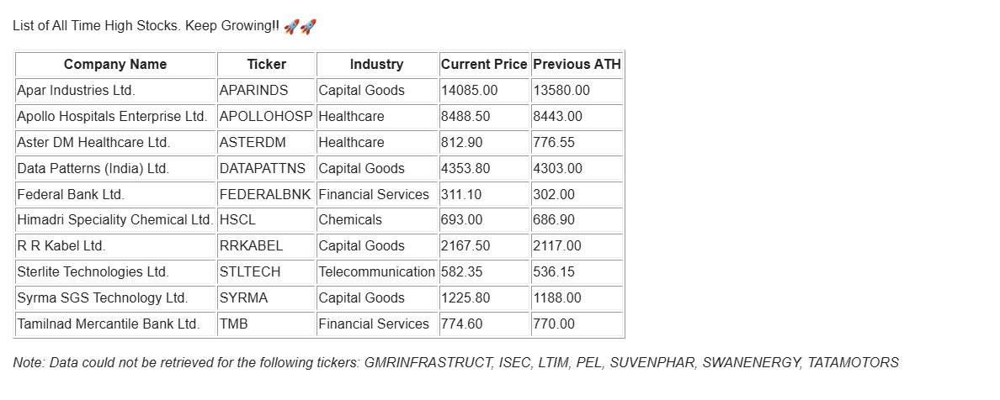

# Stock Market Breakout Alert System

Automated pipeline that scans all **NIFTY 500 stocks** for **all-time high (ATH) breakouts** and delivers a formatted email alert fully serverless on AWS.

---

## Pipeline Architecture

```
EventBridge (cron schedule)
        │
        ▼
AWS Lambda (Docker container via ECR)
        │
        ├── BeautifulSoup  →  scrapes NIFTY 500 ticker list from Wikipedia
        │
        ├── yfinance       →  downloads full historical OHLCV price data
        │
        ├── pandas         →  cleans data, calculates all-time highs, filters breakouts
        │
        ├── smtplib        →  sends formatted HTML email alert to recipient
        │
        └── CloudWatch     →  logs execution results and errors
```

---

## Features

- Scrapes live NIFTY 500 ticker symbols from Wikipedia using `BeautifulSoup`
- Downloads full historical OHLCV data via `yfinance` with back-adjusted pricing
- Identifies breakout stocks where the current closing price exceeds the previous all-time high
- Sends a formatted HTML email report listing all breakout stocks with company name, industry, current price, and previous ATH
- Fully containerized with Docker and deployed to AWS ECR
- Scheduled via AWS EventBridge runs automatically without manual intervention
- Execution logs and errors captured in AWS CloudWatch
- Credentials managed securely via Lambda environment variables no secrets in code

---

## Tech Stack

| Layer               | Technology                                      |
|---------------------|-------------------------------------------------|
| Data Ingestion      | `yfinance`, `BeautifulSoup`, `requests`         |
| Data Processing     | `pandas`                                        |
| Alerting            | `smtplib`, `ssl`, `email` (Python stdlib)       |
| Compute             | AWS Lambda                                      |
| Scheduler           | AWS EventBridge                                 |
| Logging             | AWS CloudWatch                                  |
| Containerization    | Docker, AWS ECR                                 |

---

## Sample Output



---

## Project Structure

```
├── src/
│   ├── lambda_function.py    # Core pipeline scraper, ATH detector, email sender, Lambda handler
├── test_breakout_alert.ipynb # Local test notebook for running and validating the pipeline
├── Dockerfile                # Container configuration for Lambda deployment
├── requirements.txt          # Python dependencies
├── .gitignore
└── README.md
```

---

## Setup & Deployment

### Prerequisites
- Python 3.13+
- Docker
- AWS CLI configured with appropriate IAM permissions
- Gmail account with [App Password](https://myaccount.google.com/apppasswords) enabled (2FA required)

### Environment Variables

Credentials are loaded from Lambda environment variables — nothing is stored in code or files.

Set these under **AWS Lambda → Configuration → Environment Variables**:

| Variable          | Description                                         |
|-------------------|-----------------------------------------------------|
| `EMAIL_SENDER`    | Gmail address used to send alerts                   |
| `EMAIL_PASSWORD`  | Gmail App Password (not your Gmail login password)  |
| `RECIPIENT`       | Email address to receive alerts                     |

### Deploy to AWS Lambda

```bash
# 1. Build the Docker image
docker build -t breakout-alert .

# 2. Authenticate Docker with ECR
aws ecr get-login-password --region <region> | \
  docker login --username AWS --password-stdin \
  <account-id>.dkr.ecr.<region>.amazonaws.com

# 3. Tag and push to ECR
docker tag breakout-alert:latest \
  <account-id>.dkr.ecr.<region>.amazonaws.com/breakout-alert:latest

docker push \
  <account-id>.dkr.ecr.<region>.amazonaws.com/breakout-alert:latest
```

Then in the AWS Console:
1. Create or update your Lambda function to use the ECR container image
2. Set the three environment variables listed above
3. Attach an EventBridge rule with your desired cron schedule

### Running Locally

A Jupyter notebook (`test_breakout_alert.ipynb`) is included for local testing without deploying to AWS.

```bash
pip install -r requirements.txt
jupyter notebook test_breakout_alert.ipynb
```

The notebook lets you test the scraper, run a single-ticker ATH check, preview the email output, and send a real alert — all without touching Lambda.

---

## Author

**Dhir Patel** — Data Analyst  
[LinkedIn](https://www.linkedin.com/in/dhir-patel14/) · [GitHub](https://github.com/pateldhir97/)
